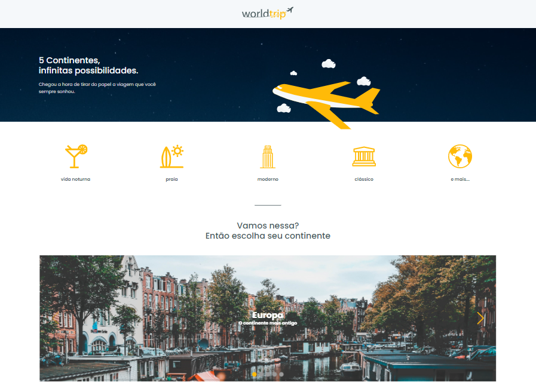
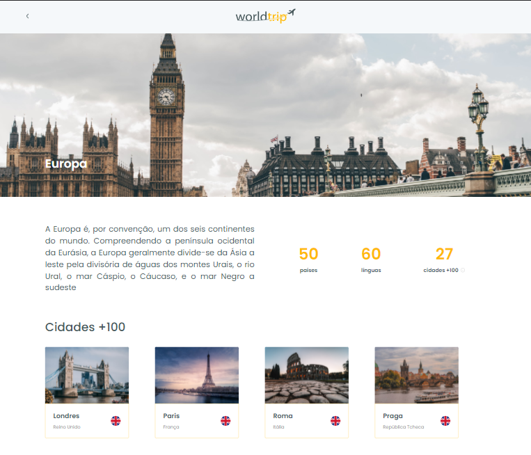

# world-trip

<p align="center">
  
</p>

<p align="center">
  
       
  
</p>

<br />

<div align="center">
    
    
</div>

<br>

## Tecnologias

Esse projeto foi desenvolvido com:

- [React](https://reactjs.org)
- [TypeScript](https://www.typescriptlang.org)
- [Next](https://nextjs.org/)
- [Chakra UI](https://chakra-ui.com/)
- [Miragejs](https://miragejs.com/)
---
<h2 align="center">Sobre 📖</h2>
   
<p>
   Esse projeto foi um desafio do Ignite da Rocketseat, foi disponibilizado o layout da aplicação no figma e as funcionalidades que <br />
    deveriam ser realizadas, foi totalmente desenvolvido por mim para testar alguns conhecimentos com Chakra UI e Nextjs
</p>
---

## Execução do projeto

Clone o projeto e acesse a pasta do mesmo.

```bash
$ git clone https://github.com/lucasggmc/world-trip-app
$ cd world-trip-app
```

Para iniciar, siga os passos abaixo:
```bash
# Instalar todas as dependências do projeto
$ yarn

# Iniciar o projeto
$ yarn dev
```
Se tudo correr bem o app estará disponível no seu browser pelo endereço http://localhost:3000 ou por outra porta indicada pela própria aplicação.

A FAKE API do Miragejs deve iniciar automaticamente e a aplicação já estará funcionando com alguns informações da API.

OBS: Foi populado somente informações para os continentes Europa e Ásia.
